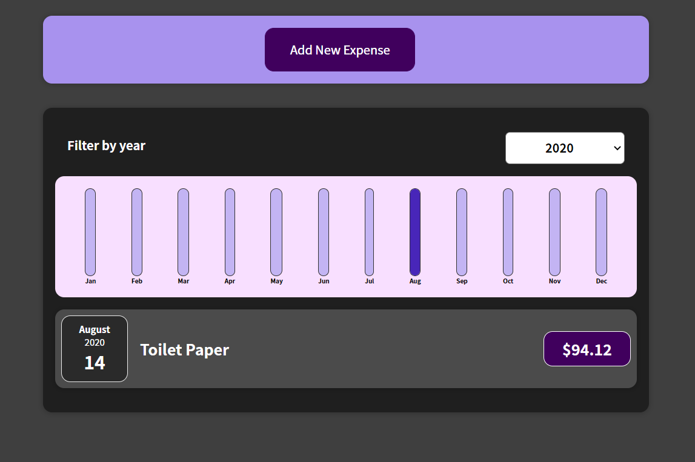
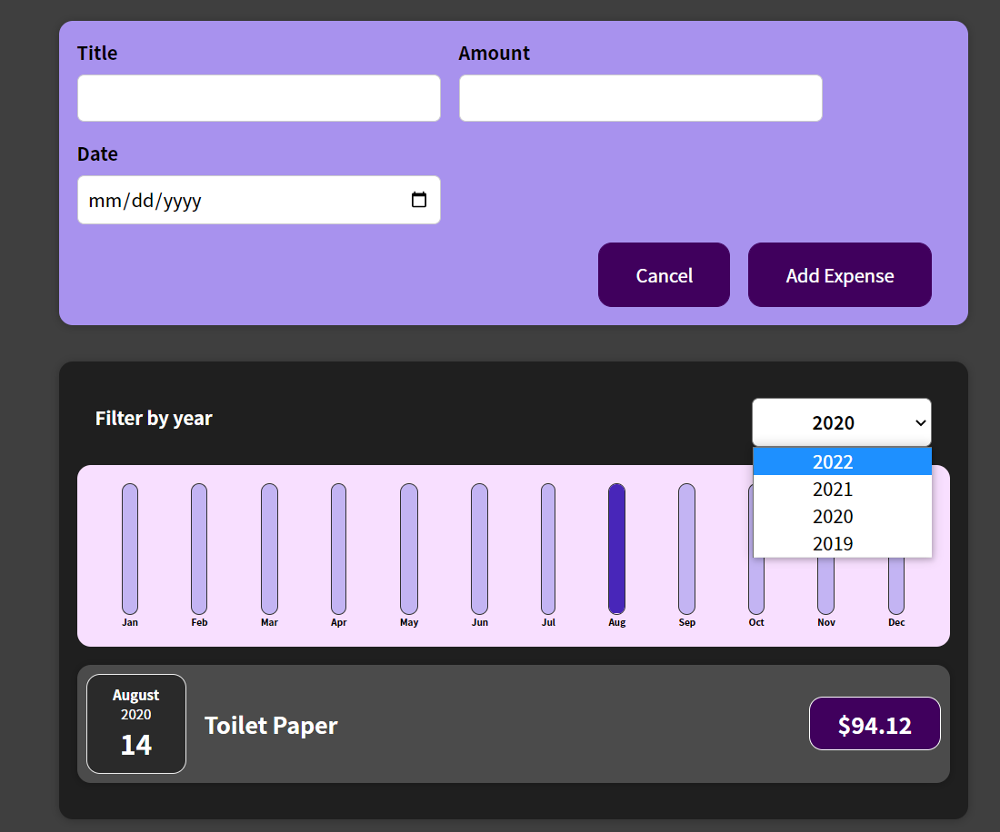

# expense_tracker
mini expense tracker in react with props, states and hooks
##  Expense Tracker

## AIM OF THE PROJECT

### I mastered:

- [x] Functional components in react;
- [x] useState hook;
- [x] props;
- [x] nesting components in the root component;
- [x] controlled inputs;
- [x] handler functions;

[demo link](https://serhiisergio.github.io/expense_tracker/)

### SCREENSHOTS

## STRUCTURE OF THE PROJECT

This project consists of a root component `App.js` which contains several components with their css styles.

Go up to the [Header](#header) !
